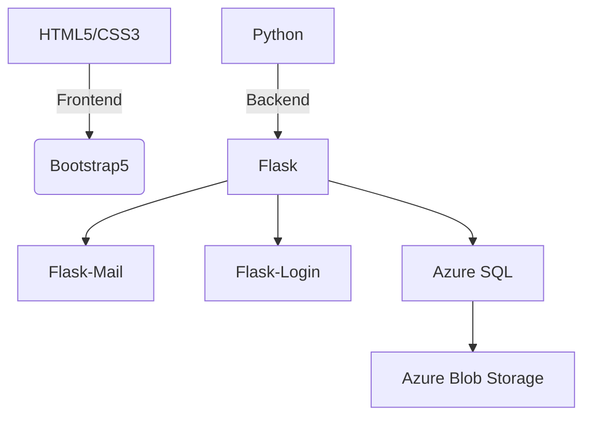

<div align="center">


🎓 <b>Smart, Secure & Scalable Complaint Solution</b> for Students and Administrators.


</div>

---

## ✨ Key Features

* 🎓 Student Portal to file complaints easily
* 🛡️ Admin Dashboard with status filters
* 📬 Email notifications with progress updates
* ☁️ Azure Blob integration for file upload
* 🔐 Secure login and session management
* 🧠 Future AI and ML integration

---


### 📦 Requirements
- Python 3.7+
- Azure Account for Storage & DB
- SMTP Email Credentials


## 🌐 Tech Stack




## ⚙️ Installation Steps

```bash
# Clone the Repository
git clone https://github.com/Amank326/Complaint---Management-
cd Complaint-management

# Create Virtual Environment
python -m venv venv
source venv/bin/activate     # Windows: venv\Scripts\activate

# Install Dependencies
pip install -r requirements.txt

# Run the Application
python app.py
```

> ✏️ Ensure `.env` is properly set with your Azure and email credentials.

---

## 🧠 Future Scope

* 🤖 NLP-based Complaint Classification
* 📈 Admin Analytics Dashboard
* ⏱️ Resolution Time Predictor
* 🔔 Push Notifications

---

## 📂 Folder Structure

```bash
Complaint-management/
├── app.py
├── templates/
├── static/
├── uploads/
├── config.py
├── requirements.txt
```


## 👨‍💻 Made With

```bash
💡 Passion for solving real-world problems
💻 Power of Python + Azure
🎨 Taste of modern UI with Bootstrap5
```


## 📜 License

This project is licensed under the **MIT License** - see the [LICENSE](LICENSE) file for details.

---

## 🙋‍♂️ Connect With Me

<p align="center">
  <a href="https://github.com/sahutushar"></a>
  <a href="https://linkedin.com"></a>


---

<p align="center">
  
</p>


